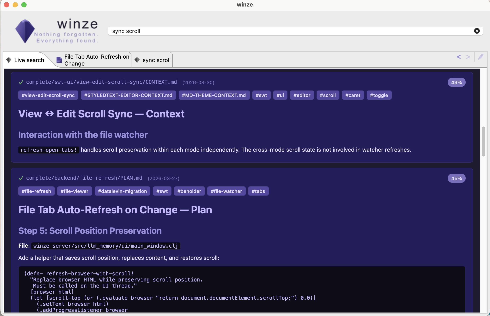

# winze — persistent project memory for AI coding assistants

> *A winze is a shaft that takes one deeper in a (data) mine*

AI coding assistants start every session with a blank slate. They don't
know what you decided last week, why you chose approach A over B, or
what's half-finished in a branch. You end up re-explaining context, and
the AI re-reads files it already analyzed.

Winze fixes this. 

Iterate with your AI to write planning documents as markdown files in a
`Plans/` directory; Winze indexes them with vector embeddings so your
AI recovers full context in seconds — across sessions, across projects.
A filesystem watcher keeps the index current in real time as you (or
your AI) edit documents.  Edit using the embedded rich Markdown editor or
the editor of your choice.



## One knowledge base, two interfaces

Your planning documents are plain markdown in Git — browse them in your
editor, review them in PRs, search them on GitHub. Winze adds semantic
search on top, so your AI assistant finds relevant context by meaning,
not keywords. One set of files serves both audiences without duplication.

**For AI agents:** persistent memory, semantic search, structured
metadata filters (status, type, group), and a self-maintaining index.

**For humans:** readable files, Git history, meaningful diffs, and a
native desktop UI with a rich Markdown editor and search-as-you-type.

## Key features

- **No API keys, no external services** — embeddings run entirely
  in-JVM via inference4j (all-MiniLM-L12-v2, 384d)
- **Rich Markdown editor** — Edit documents with a beautiful styled
  text editor
- **Filesystem watcher** — external edits (including by your coding
  agent) appear in search results within a second, no manual indexing
- **Metadata inference** — status, type, group, and Jira key derived
  automatically from directory/filename conventions (~97% coverage)
- **Multi-project support** — one store indexes multiple project roots
  with scoped search
- **Native desktop UI** — live search, system tray icon, file viewer
  with markdown rendering, tabbed navigation (Eclipse SWT via
  Clojure Desktop Toolkit)
- **Claude Code integration** — MCP server with seven slash command
  skills (`/search-plans`, `/index-plans`, `/recent-plans`, etc.)

## Why not just...

| Approach | What's missing |
|----------|---------------|
| Paste context into every prompt | Doesn't scale; you forget things; wastes tokens |
| Code comments | Explain *what*, not *why* or *what you tried and rejected* |
| Wiki / Confluence | AI can't search it efficiently; goes stale; separate from code |
| Git commit messages | Too granular; no narrative; no semantic search |
| AI memory features | Opaque; not version-controlled; limited capacity |

## Install from source

Requires JDK 21+ on `PATH` ([Eclipse Temurin](https://adoptium.net/) recommended). Everything else is handled automatically.

### On Mac

```bash
cd winze-server && make dmg
```

Creates a `dmg` volume with an installable Mac application.

### Other platforms

```bash
cd winze-server && make install-winze
```

Builds a self-contained package (jlink JRE + uberjar + Babashka),
installs to `~/.local/share/winze/`, registers the MCP server with
Claude Code, and installs all slash command skills. The server
auto-starts on first use.

(Patches to auto-register the MCP server with other agents are welcome!)

See [winze-server/README.md](winze-server/README.md) for full
documentation, including the [workflow guide](winze-server/docs/workflow.md)
explaining the three-layer architecture and how to use the system
effectively.

## Architecture

```
Claude Code
    │ JSON-RPC (stdio)
bb mcp-proxy.clj          ← Babashka, translates MCP to nREPL
    │ nREPL (localhost)
winze-server JVM          ← long-lived, persists between sessions
    │
clj-llm-memory            ← core library
    │
Datalevin + inference4j   ← storage + embeddings
    │
~/.local/share/winze/
```

## Projects

### [winze-server](winze-server/) — Server, MCP integration, and native UI

The application layer: nREPL server, Babashka MCP proxy, SWT desktop
window with live search, and Claude Code skill definitions.

### [clj-llm-memory](clj-llm-memory/) — Core library

The engine: HNSW vector index via Datalevin, markdown chunking,
metadata inference, incremental reconciliation, and filesystem watching.
Use this directly if you want to embed the search engine in your own
application.

## Requirements

- **JDK 21+** on `PATH` — [Eclipse Temurin](https://adoptium.net/) recommended. The Clojure CLI is installed automatically if not present.
- **Claude Code** — for MCP registration and slash command skills
- **Platform**: macOS ARM64, Linux AMD64/ARM64, or Windows AMD64
